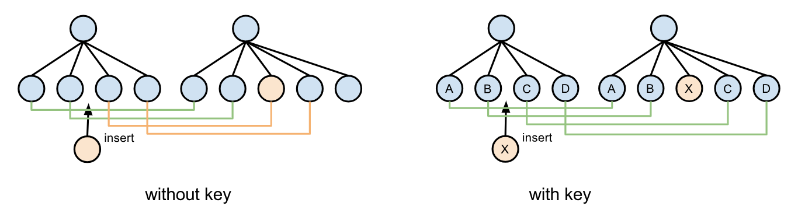

1. react 区分 class 与函数式组件，在 class 实例化之前
   ```
   1. XXXX.prototype.isReactComponent 判断
   2. XXXX.prototype instanceof React.Component 判断
   ```
2. react-router link 与 a 区别

   [参考](https://blog.csdn.net/sinat_17775997/article/details/66967854)

   ```
   对比<a>,Link组件避免了不必要的重渲染
   ```

3. setState 为什么是异步

   参考：

   [React 中 setState 真的是异步的吗](https://juejin.im/post/5ac1aaad6fb9a028d444bb87)

   [setState 异步、同步与进阶](https://juejin.im/post/5bf1444cf265da614a3a1660)

   [issue](https://github.com/facebook/react/issues/11527#issuecomment-360199710)

   [React 中 setState() 为什么是异步的?](https://juejin.im/post/5a6f440a51882573336652af)

   注：`setState`只是模拟异步行为，它是伪异步

   ```
   1. 保证内部的一致性：即使state是同步更新，props也不是。（你只有在父组件重新渲染时才能知道props）
   2. 将state的更新延缓到最后批量合并再去渲染对于应用的性能优化是有极大好处的，如果每次的状态改变都去重新渲染真实dom，那么它将带来巨大的性能消耗。
   ```

   ```
   保证批量更新，
   1.在组件生命周期中或者react事件绑定中，setState是通过异步更新的。
   2.在延时的回调或者原生事件绑定的回调中调用setState不一定是异步的。
   ```

4. react 事件机制

   > 事件代理

   [参考](https://segmentfault.com/a/1190000008782645)

5. react,Key 具体起到了什么作用，如果不加 key，diff 算法如何改变

   > 当子节点有 key 时，React 使用 key 来匹配原本树的子节点和新树的子节点。例如，增加一个 key 在之前效率不高的样例中能让树的转换变得高效

   

   > 当没有 key 的时候，如果中间插入一个新节点，Diff 过程中从第三个节点开始的节点都是删除旧节点，创建新节点。当有 key 的时候，除了第三个节点是新创建外，第四和第五个节点都是通过移动实现的。

   [react](https://react.docschina.org/docs/reconciliation.html#keys)
   [React 源码深度解读（十）：Diff 算法详解](https://segmentfault.com/a/1190000017039293)

6. 14.15.16 react diff 算法区别

7. react 中的 Fiber

   [react](https://react.docschina.org/docs/faq-internals.html#%E4%BB%80%E4%B9%88%E6%98%AFreact-fiber%EF%BC%9F)
   [介绍](https://github.com/xxn520/react-fiber-architecture-cn)

8. react HOC 缺点
